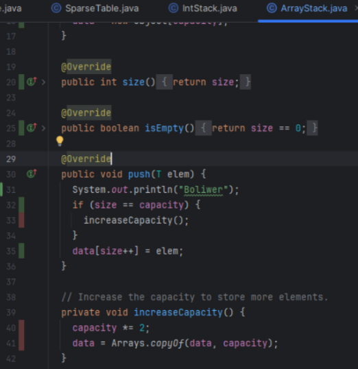
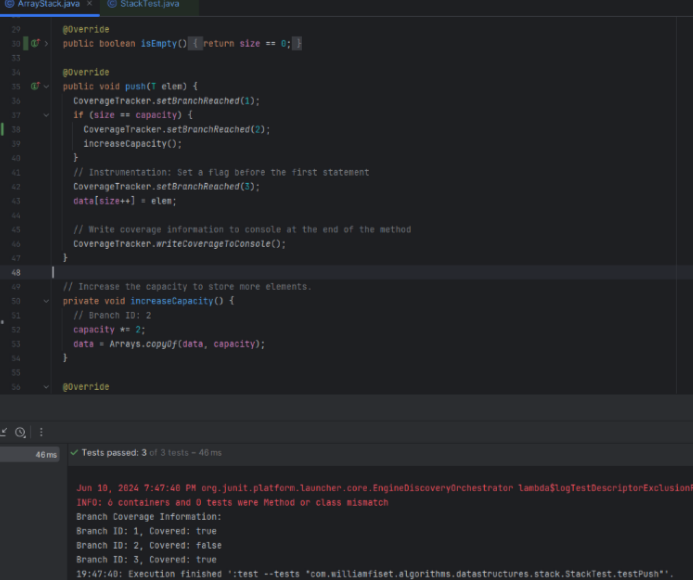
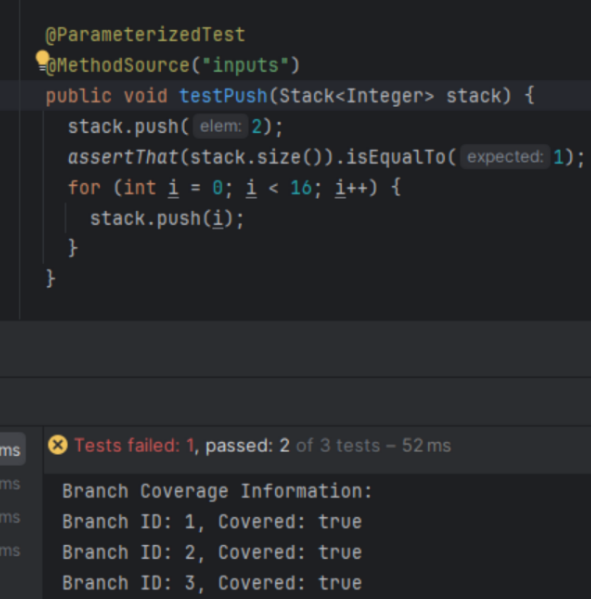
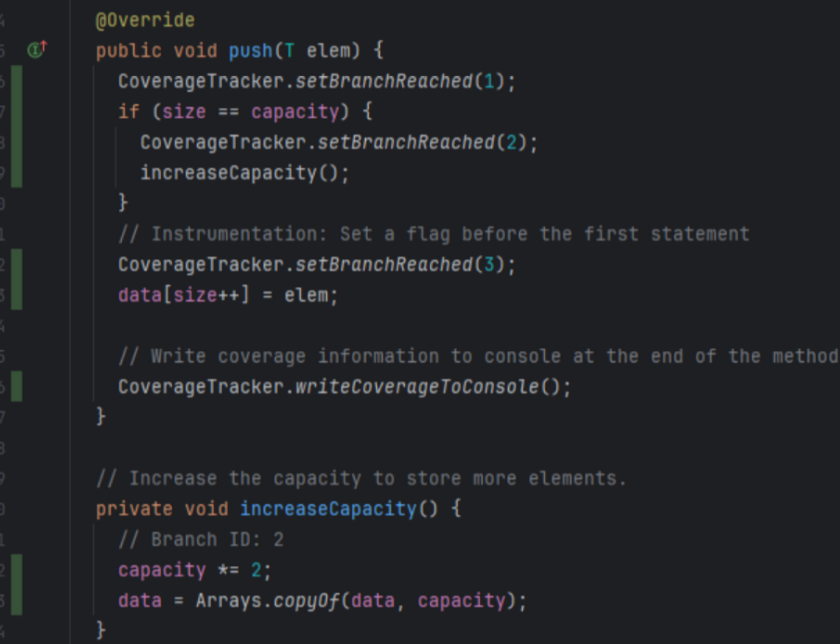
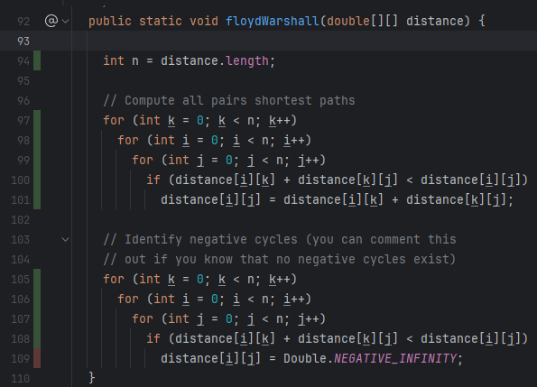
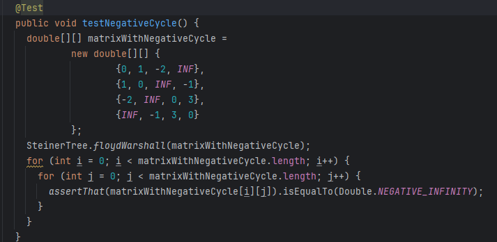

## Work done in mt_branch1:

The `ArrayStack` class contains the `push` function [here](src/main/java/com/williamfiset/algorithms/datastructures/stack/ArrayStack.java).  
The `StackTest` class contains the test for push, called: `testPush` [here](src/test/java/com/williamfiset/algorithms/datastructures/stack/StackTest.java).
  
In the image below, we’re checking coverage for testPush through the intellij coverage tester.   

We can see initially it's 2/3rds covered. as size == capacity is not covered (this can be seen with the red and green lines)
  
In the image below, we’re checking coverage with our own tool, and I have the same output 2/3rds.

   
In the image below, we altered the testPush function to improve it. We do this by checking whether the  size == capacity which wasn’t checked before. This increases coverage to 3/3 (100%) 

  
In the image below, we can see that the built-in tool also states 100% coverage

## Work done in mt_branch2:

The `SteinerTree` class contains the `floydWarshall` function [here](src/main/java/com/williamfiset/algorithms/graphtheory/SteinerTree.java).  
The `SteinerTreeTest` class contains the tests for the Steiner Trees [here](src/test/java/com/williamfiset/algorithms/graphtheory/SteinerTreeTest.java).
  
Within the floydWarshall function we need to check whether the steiner tree has a negative cycle, since negative cycles can invalidate any distance calculation.
  
as seen in the image below, when tested with intellij coverage testing, the entire function is covered, except for the check for the negative cycle.
 

 
In the image below, we’re checking coverage with our own tool and we get 1/3rd coverage on the final iteration, since it doesn't check for negative cycles nor for setting negative infinity
 

  
In the image below, you can see an added test `testNegativeCycle` which introduces a negative cycle to be tested to improve coverage
  

  
With the addition of this function, the coverage has been improved to 100% both in our own tool and in intellij coverage tool as can be seen in the image below:
 

